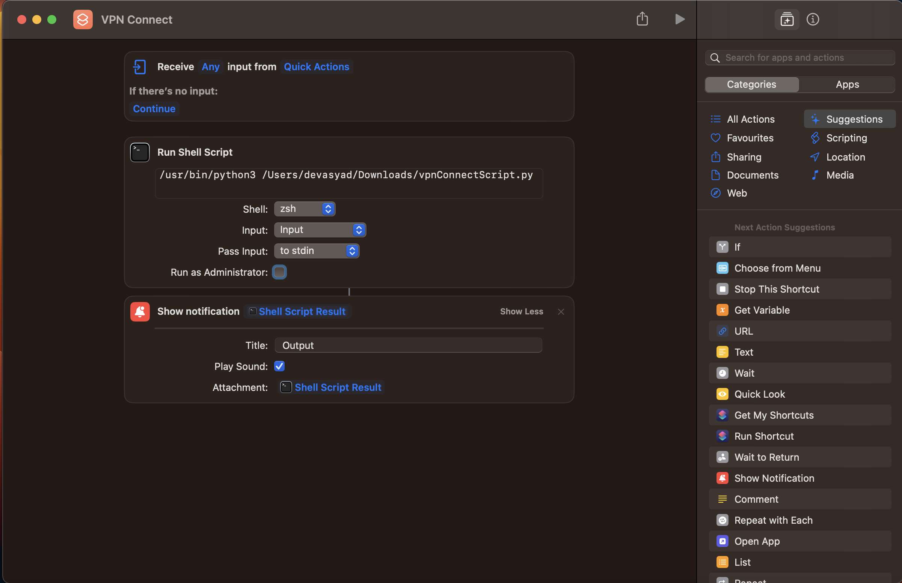
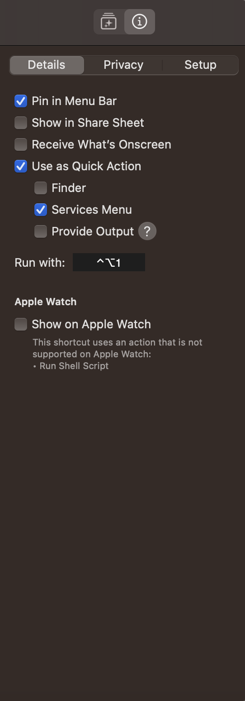

these are the scripts you can use to connect to cisco vpn withoout using password on mac.

you can even map these scripts to keyboard shortcuts using Shortcuts app in mac

screenshot of adding shortcuts in mac

adding keyboard shortcut to the new shortcut you created

